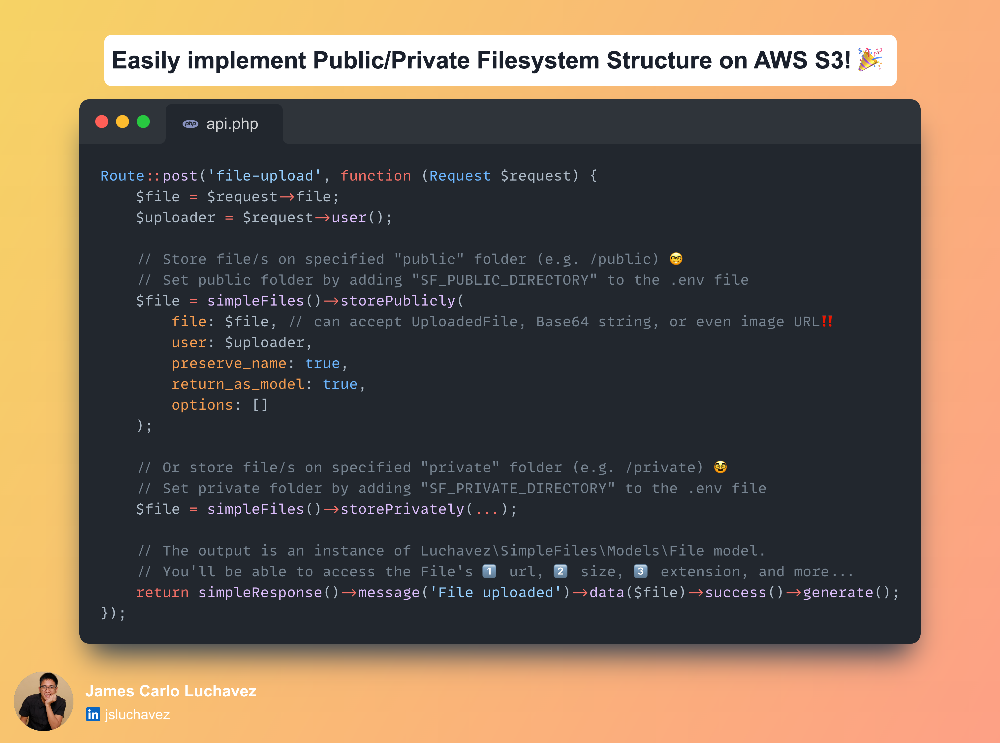
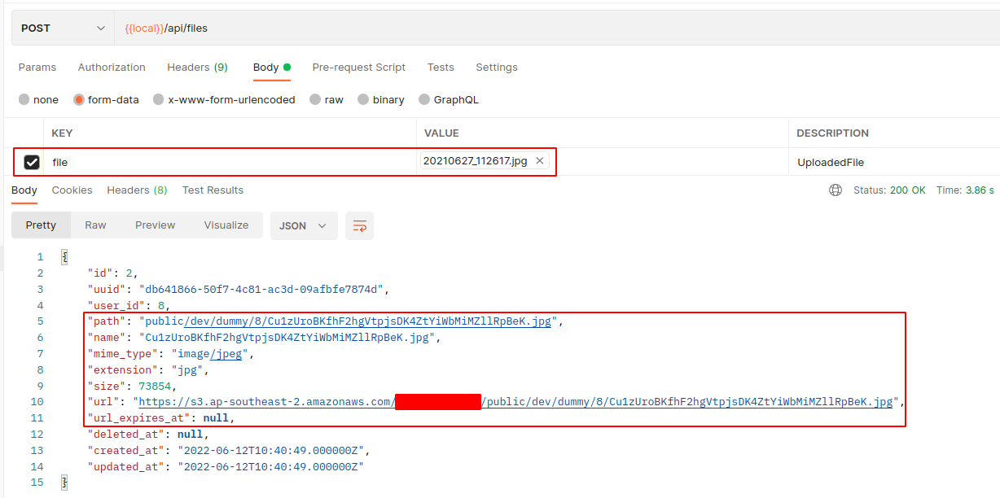
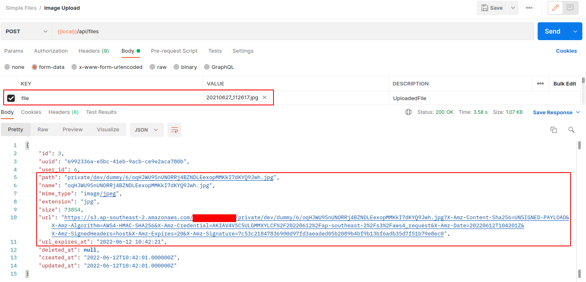
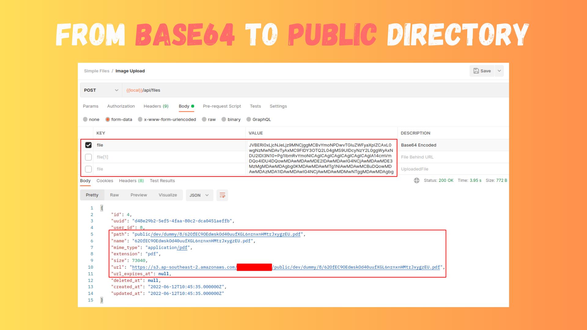
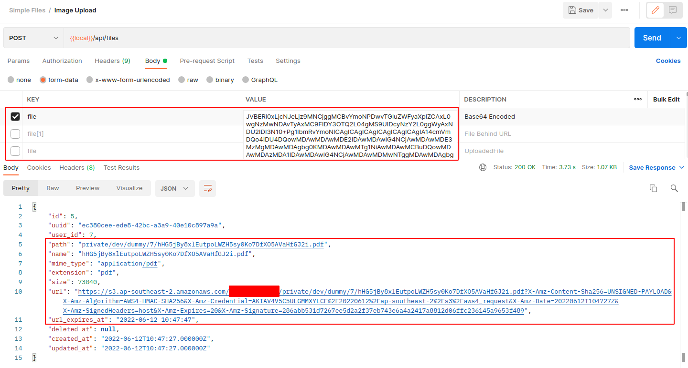
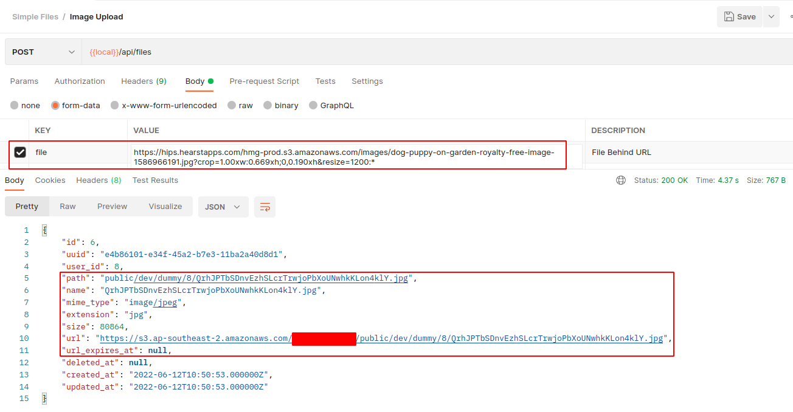
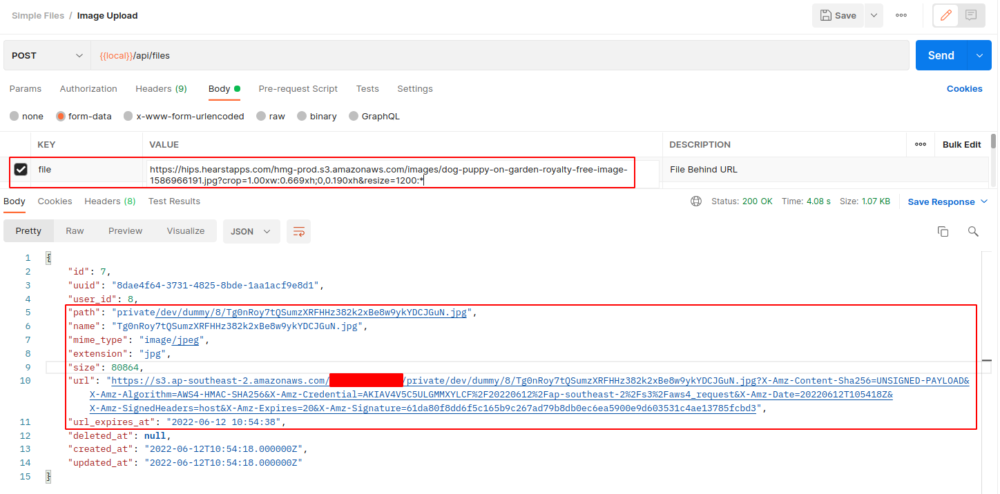
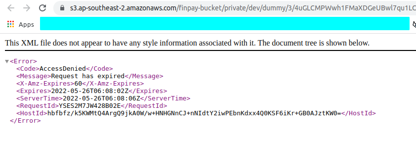

# Simple Files

[![Latest Version on Packagist][ico-version]][link-packagist]
[![Total Downloads][ico-downloads]][link-downloads]



## Introduction

Implementing a public-private filesystem structure to your Laravel application can be a hassle. But with "luchavez/simple-files", it's easy! This package is built with that in mind so that you can proceed with more important things in your project. It's perfect for Laravel applications that need to work with files. And the best part? It can process not only uploaded files but also Base64 strings and image URLs! Plus, it's especially effective on AWS S3 buckets. Try it out today and see how it can help you!

<p align="center"></p>

Check out the [examples](#examples) below to get a clearer picture.

## Installation

Via Composer

``` bash
$ composer require luchavez/simple-files:^1.0.0
```

## Setting Up

1. Add the [HasFilesTrait](./src/Traits/HasFilesTrait.php) trait to all the Eloquent models that can own files.

2. Run the migrations to add the [**files**](./database/migrations/2022_03_30_000000_create_files_table.php) and [**fileables**](./database/migrations/2022_03_30_000002_create_fileables_table.php) tables.

3. Add these variables to `.env` file if you want to override the default values.

| Variable Name           | Default Value                   |
|-------------------------|---------------------------------|
| `SF_FILESYSTEM_DRIVER`  | `config('filesystems.default')` |
| `SF_EXPIRE_AFTER_UNIT`  | `days`                          |
| `SF_EXPIRE_AFTER_VALUE` | 1                               |
| `SF_PUBLIC_DIRECTORY`   | `public`                        |
| `SF_PRIVATE_DIRECTORY`  | `private`                       |


## Usage

### SimpleFiles

The package provides a service called [**SimpleFiles**](src/Services/SimpleFiles.php) which you can use by calling its [helper functions](helpers/simple-files-helper.php):
1. `simpleFiles()`
2. `simple_files()`

Here's the list of its available methods.

| Method Name               | Return Type                                              | Description                                                                        |
|---------------------------|----------------------------------------------------------|------------------------------------------------------------------------------------|
| `getFileSystemDriver`     | `string`                                                 | gets the filesystem driver                                                         |
| `getDriver`               | `string`                                                 | shortcut for `getFileSystemDriver` method                                          |
| `getExpireAfterUnit`      | `string`                                                 | gets the time unit for temporary URL expiration                                    |
| `getExpireAfterValue`     | `string`                                                 | gets the time value for temporary URL expiration                                   |
| `getExpireAfter`          | `Illuminate\Support\Carbon`                              | gets the `Carbon` equivalent of `getExpireAfterUnit()` and `getExpireAfterValue()` |
| `getPublicDirectory`      | `string`                                                 | gets the specified `public` directory                                              |
| `getPrivateDirectory`     | `string`                                                 | gets the specified `private` directory                                             |
| `shouldOverwriteOnExists` | `bool`                                                   | decides whether to overwrite or not when it already exists                         |
| `getFileSystemAdapter`    | `Illuminate\Contracts\Filesystem\Filesystem`             | gets the filesystem adapter                                                        |
| `getAdapter`              | `Illuminate\Contracts\Filesystem\Filesystem`             | shortcut for `getFileSystemAdapter` method                                         |
| `getPublicAdapter`        | `Illuminate\Contracts\Filesystem\Filesystem`             | uses `getFileSystemAdapter` method with `$is_public` to `true`                     |
| `getPrivateAdapter`       | `Illuminate\Contracts\Filesystem\Filesystem`             | uses `getFileSystemAdapter` method with `$is_public` to `false`                    |
| `store`                   | `Luchavez\SimpleFiles\Models\File or Collection or null` | stores file/s to specified `public` or `private` directory                         |
| `storePublicly`           | `Luchavez\SimpleFiles\Models\File or Collection or null` | uses `store()` method with `$is_public` to `true`                                  |
| `storePrivately`          | `Luchavez\SimpleFiles\Models\File or Collection or null` | uses `store()` method with `$is_public` to `false`                                 |
| `getContentsFromURL`      | `string or null`                                         | gets contents by using `file_get_contents()`                                       |
| `getContentsFromBase64`   | `string or null`                                         | gets contents by using `base64_decode()`                                           |
| `getFiles`                | `array`                                                  | gets files list from specified `public` or `private` directory                     |
| `getPublicFiles`          | `array`                                                  | uses `getFiles()` method with `$is_public` to `true`                               |
| `getPrivateFiles`         | `array`                                                  | uses `getFiles()` method with `$is_public` to `false`                              |
| `getFile`                 | `string or null`                                         | gets file contents                                                                 |
| `getFilePublicly`         | `string or null`                                         | uses `getFile()` method with `$is_public` to `true`                                |
| `getFilePrivately`        | `string or null`                                         | uses `getFile()` method with `$is_public` to `false`                               |
| `putFile`                 | `string or null`                                         | uploads file to specified `public` or `private` directory                          |
| `putFilePublicly`         | `string or null`                                         | uses `putFile()` method with `$is_public` to `true`                                |
| `putFilePrivately`        | `string or null`                                         | uses `putFile()` method with `$is_public` to `false`                               |
| `putFileAs`               | `string or null`                                         | uploads file to specified `public` or `private` directory                          |
| `putFilePubliclyAs`       | `string or null`                                         | uses `putFileAs()` method with `$is_public` to `true`                              |
| `putFilePrivatelyAs`      | `string or null`                                         | uses `putFileAs()` method with `$is_public` to `false`                             |
| `exists`                  | `bool`                                                   | checks if file exists on specified `public` or `private` directory                 |
| `existsPublicly`          | `bool`                                                   | uses `exists()` method with `$is_public` to `true`                                 |
| `existsPrivately`         | `bool`                                                   | uses `exists()` method with `$is_public` to `false`                                |
| `delete`                  | `bool`                                                   | deletes file/s from specified `public` or `private` directory                      |
| `deletePublicly`          | `bool`                                                   | uses `delete()` method with `$is_public` to `true`                                 |
| `deletePrivately`         | `bool`                                                   | uses `delete()` method with `$is_public` to `false`                                |
| `getDirectories`          | `array`                                                  | gets files list from specified `public` or `private` directory                     |
| `getPublicDirectories`    | `array`                                                  | uses `getDirectories()` method with `$is_public` to `true`                         |
| `getPrivateDirectories`   | `array`                                                  | uses `getDirectories()` method with `$is_public` to `false`                        |
| `deleteFiles`             | `bool`                                                   | deletes files from specified `public` or `private` directory                       |
| `deletePublicFiles`       | `bool`                                                   | uses `deleteFiles()` method with `$is_public` to `true`                            |
| `deletePrivateFiles`      | `bool`                                                   | uses `deleteFiles()` method with `$is_public` to `false`                           |
| `relateFileModelTo`       | `void`                                                   | dynamically build relationship from any model to the `File` model                  |
| `generateUrl`             | `void`                                                   | create a new url or temporary url to a Luchavez\SimpleFiles\Models\File instance   |

### HasFilesTrait

The package also provides [**HasFilesTrait**](src/Traits/HasFilesTrait.php) which you can use on Eloquent models that you want to have files or images.

- If a **User** model needs profile pictures...

```injectablephp
use Luchavez\SimpleFiles\Traits\HasFilesTrait;

class User extends Authenticatable
{
    use HasFactory, Notifiable, HasFilesTrait;
...
```
- Or, if a **Company** model needs logos...

```injectablephp
use Luchavez\SimpleFiles\Traits\HasFilesTrait;

class Company extends Model
{
    use HasFactory, HasFilesTrait;
...
```
- Or, if a **Food** model needs some Instagram-worthy images...
```injectablephp
use Luchavez\SimpleFiles\Traits\HasFilesTrait;

class Food extends Model
{
    use HasFactory, HasFilesTrait;
...
```

Here's the list of methods that will be added to Eloquent models.

| Method Name          | Return Type                                          | Description               |
|----------------------|------------------------------------------------------|---------------------------|
| `files`              | `Illuminate\Database\Eloquent\Relations\MorphToMany` | gets all files            |
| `images`             | `Illuminate\Database\Eloquent\Relations\MorphToMany` | gets all image files      |
| `nonImages`          | `Illuminate\Database\Eloquent\Relations\MorphToMany` | gets all non-image files  |
| `fileables`          | `Illuminate\Database\Eloquent\Relations\MorphMany`   | gets all fileables        |
| `fileable`           | `Illuminate\Database\Eloquent\Relations\MorphOne`    | gets latest fileable      |
| `imageables`         | `Illuminate\Database\Eloquent\Relations\MorphMany`   | gets all imageables       |
| `imageable`          | `Illuminate\Database\Eloquent\Relations\MorphOne`    | gets latest imageable     |
| `nonImageables`      | `Illuminate\Database\Eloquent\Relations\MorphMany`   | gets all non-imageables   |
| `nonImageable`       | `Illuminate\Database\Eloquent\Relations\MorphOne`    | gets latest non-imageable |
| `attachFiles`        | `void`                                               | attaches file/s to model  |
| `attachPublicFiles`  | `void`                                               | attaches file/s to model  |
| `attachPrivateFiles` | `void`                                               | attaches file/s to model  |
| `syncFiles`          | `void`                                               | syncs file/s to model     |
| `syncPublicFiles`    | `void`                                               | syncs file/s to model     |
| `syncPrivateFiles`   | `void`                                               | syncs file/s to model     |
| `detachFiles`        | `void`                                               | detaches file/s to model  |
| `detachPublicFiles`  | `void`                                               | detaches file/s to model  |
| `detachPrivateFiles` | `void`                                               | detaches file/s to model  |

## Examples

**Note**: In case you did not specify the user who uploaded the file, it will try to get the authenticated user via `auth()->user()`.

Here are the `.env` variables used in this example:

```dotenv
SF_FILESYSTEM_DRIVER=s3
SF_PUBLIC_DIRECTORY=public/dev/dummy
SF_PRIVATE_DIRECTORY=private/dev/dummy
SF_EXPIRE_AFTER_UNIT=minutes
SF_EXPIRE_AFTER_VALUE=2
```

### Uploading files

Let's start first by creating a public route `/api/files`. Use `storePublicly()` and `storePrivately()` methods of `simpleFiles()` global helper function to store the files on `public/dev/dummy` and `private/dev/dummy` directories respectively.

- Using `storePublicly()` with `$request->user()` as uploader.
```injectablephp
Route::post('/files', function (Request $request) {
    $file = $request->file;
    $user = $request->user();
    
    return simpleFiles()->storePublicly(file: $file, user: $user)->toArray();
});
```
- Using `storePrivately()` with `$request->user()` as uploader.
```injectablephp
Route::post('/files', function (Request $request) {
    $file = $request->file;
    $user = $request->user();
    
    return simpleFiles()->storePrivately(file: $file, user: $user)->toArray();
});
```

Once that is set up, we can use [Postman](https://www.postman.com/) to upload files to the route above.

- Here's an example of normal `FormData` file upload using `storePublicly()`.



- Here's an example of normal `FormData` file upload using `storePrivately()`.



- Here's an example of `Base64` encoded file upload using `storePublicly()`.



- Here's an example of `Base64` encoded file upload using `storePrivately()`.



- Here's an example of file upload from `URL` using `storePublicly()`.



- Here's an example of file upload from `URL` using `storePrivately()`.



**Note**: If you will open an expired url, you'll receive a `Request has expired` error.



### Attaching files

To attach an uploaded file to a model, use the `attachFiles()` method from [**HasFilesTrait**](#hasfilestrait).

- If a **User** model needs profile pictures...

```injectablephp
Route::post('upload-files', function (Request $request) {
    $user = \App\Models\User::query()->first();
    $for_upload = $request->file;
    
    // You can attach like this...
    $file = simpleFiles()->storePublicly(file: $for_upload);
    $user->attachFiles(file: $file);
    
    // Or using a one-liner...
    $user->attachPublicFiles(file: $for_upload)
    
    return simpleResponse()->message('Successfully attached files.')->generate();
});
```
- Or, if a **Company** model needs logos...

```injectablephp
Route::post('upload-files', function (Request $request) {
    $company = \App\Models\Company::query()->first();
    $for_upload = $request->file;
    
    // You can attach like this...
    $file = simpleFiles()->storePublicly(file: $for_upload);
    $company->attachFiles(file: $file);
    
    // Or using a one-liner...
    $company->attachPublicFiles(file: $for_upload)
    
    return simpleResponse()->message('Successfully attached files.')->generate();
});
```
- Or, if a **Food** model needs some Instagram-worthy images...
```injectablephp
Route::post('upload-files', function (Request $request) {
    $food = \App\Models\Food::query()->first();
    $for_upload = $request->file;
    
    // You can attach like this...
    $file = simpleFiles()->storePublicly(file: $for_upload);
    $food->attachFiles(file: $file);
    
    // Or using a one-liner...
    $food->attachPublicFiles(file: $for_upload)
    
    return simpleResponse()->message('Successfully attached files.')->generate();
});
```

## Change log

Please see the [changelog](changelog.md) for more information on what has changed recently.

## Testing

``` bash
$ composer test
```

## Contributing

Please see [contributing.md](contributing.md) for details and a todolist.

## Security

If you discover any security related issues, please email author@email.com instead of using the issue tracker.

## Credits

- [James Carlo S. Luchavez][link-author]
- [All Contributors][link-contributors]

## License

MIT. Please see the [license file](license.md) for more information.

[ico-version]: https://img.shields.io/packagist/v/luchavez/simple-files.svg?style=flat-square
[ico-downloads]: https://img.shields.io/packagist/dt/luchavez/simple-files.svg?style=flat-square
[ico-travis]: https://img.shields.io/travis/luchavez/simple-files/master.svg?style=flat-square
[ico-styleci]: https://styleci.io/repos/12345678/shield

[link-packagist]: https://packagist.org/packages/luchavez/simple-files
[link-downloads]: https://packagist.org/packages/luchavez/simple-files
[link-travis]: https://travis-ci.org/luchavez/simple-files
[link-styleci]: https://styleci.io/repos/12345678
[link-author]: https://github.com/luchmewep
[link-contributors]: ../../contributors
